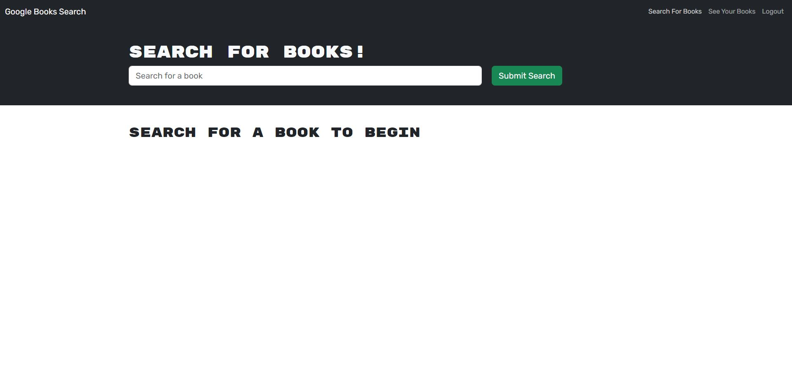

# Book Search Engine

## Description

My motivation for building this project was to gain experience with using GraphQL and Apollo Server.  I wanted to gain experience with writing and using type defs, resolvers, queries and mutations.  I built this project because I believed that GraphQL would be a worthwhile skill to learn and would help market me to future employers.  This project solves the problem of users wanting to search for books and then save their favorite books so that they can come back and view those books later.  For this project, I took a project with a RESTful API and modified it to use GraphQL.  In the process, I learned how to use GraphQL and Apollo Server.  I learned how to defined type defs, resolvers, queries, and mutations, and I also leanred how to troubleshoot the application when it didn't work as expected.

## Table of Contents (Optional)

This README isn't that long, so N/A.

## Installation

N/A

## Usage

This application has been deployed on Heroku.  To access it, please use the following link: [https://enigmatic-refuge-37219-374004c4f8c7.herokuapp.com/](https://enigmatic-refuge-37219-374004c4f8c7.herokuapp.com/)

Here is a screenshot of the book search engine:

To use the application, search for books by typing the name of a book in the search bar and clicking Submit Search.  If you wish to log in, click the Login/Sign Up button in the upper right corner.  Here, you can either sign up or log in.  To sign up, click the Sign Up button on the form that appears and enter your username, email, and password, and click Submit to continue.  So long as you have entered a unique username and email address, you will be logged into the application.  If you wish to log in, you can enter your email address and password on the login form.  You can then search for books in the above way.  Since you are now logged in, for any of the books that are returned, you can click the "Save this book" button below a book to add it to your favorites list.  In the navigation bar in the top right corner, you can then click the View Saved Books button to view your saved books.  For each of those saved books, you can click the "Delete this book" button below it to remove it from your favorites list.

## Credits

I used the Xpert Learning Assistant AI chatbot to help write some code.  I also used code from the module 21 activities for this assignment.

## License

This project is under an MIT license.  Please see the license in the GitHub repository for more information.

## Badges

I don't have any noteworthy badges to display.

## Features

This project allows the user to create an account, log in, and then search for books via the Google Books API.  Once logged in, the user can then save and delete books to and from his or her favorite list.

## How to Contribute

This was a project I personally completed, so N/A.

## Tests

N/A
